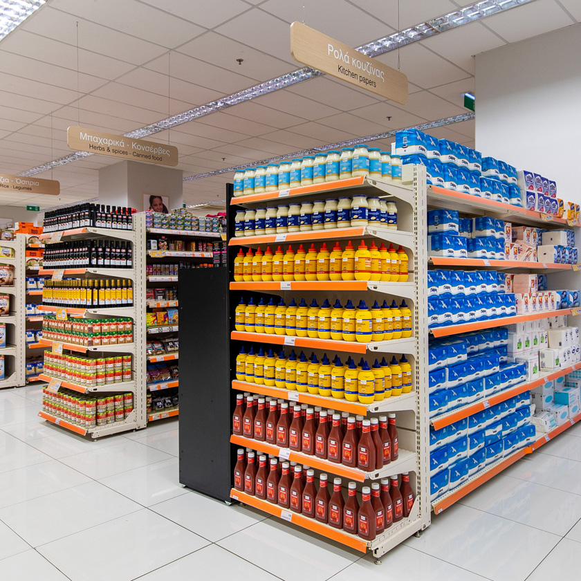

Attention bias occurs when we focus on the most visually or emotionally prominent features of a decision, rather than the most critical ones. Because our cognitive resources are limited, we anchor on what stands out, even if that attribute is irrelevant to the choice at hand and, as a result, we make suboptimal choices.

It is a sub-category of the Availability Heuristic, i.e. things that grab our attention also come to mind more easily, distorting our perception of their significance.

::: {.callout-note icon=false collapse="false"}
## **Examples**

#### Retail signage

If you are operating on a tight budget, your eyes will be drawn to the colour red or the "%" symbol. Retailers exploit this by using bright, high-contrast signage while not necessarily offering discounts. The attention the sign captures feels like evidence of a good deal.

#### Endcap placements

End-of-aisle placements ("endcaps") interrupt the repetitive shelf pattern of a supermarket, making the products placed there to contrast visually with the rest. That interruption makes them feel more prominent and cognitively "important", even when they are not on sale / promotion.

{#fig-attention width="450px" fig-align="center"}

::: {.also-relates}
**Also relates to:** [Availability Heuristic](availability-heuristic.qmd) · [Hindsight Bias](hindsight-bias.qmd) · [Confirmation Bias](confirmation-bias.qmd) · [Affect Heuristic](affect-heuristic.qmd)
:::

:::
