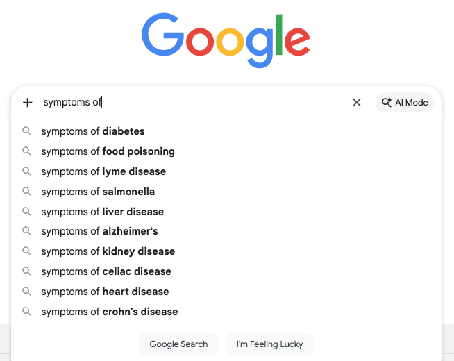

It’s when we overweigh specific information we have at hand (“representativeness”) over prior probabilities in the broader population, when making judgements.

::: {.callout-note icon=false collapse="false"}
## Example

#### Self-diagnosing online
A common example is that of self-diagnosing a rare disease based on searching our symptoms online, while ignoring the reality of its low occurrence in the general population.

Note, however, that when the representativeness information we have at hand is reliable, it’s reasonable to adjust prior probabilities: for example, an email containing the words "cryptocurrency," "inheritance," and "urgent" is more likely to be spam, compared to an average ~20% occurrence across all emails.

{width="600px" fig-align="center"}

::: {.also-relates}
**Also relates to:** [Representativeness Heuristic](representativeness.qmd) · [Availability Heuristic](availability-heuristic.qmd) · [Illusion of Validity](illusion-of-validity.qmd) · [Overconfidence](overconfidence.qmd) · [Conjunction Fallacy](conjunction-fallacy.qmd)
:::

:::
