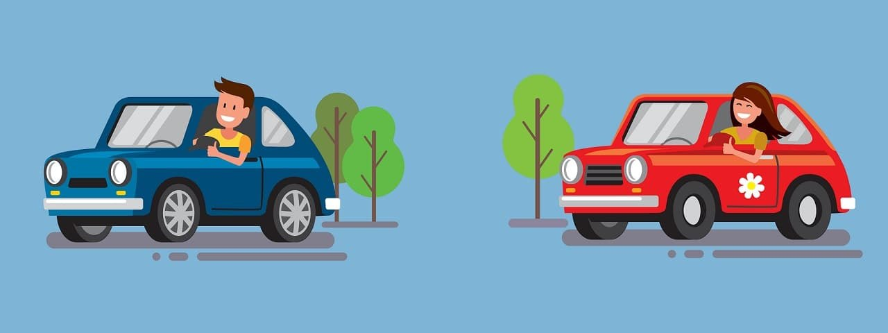

When trying to explain the causes of events, we make errors resulting from the prominence of available information, stereotypes etc.

::: {.callout-note icon=false collapse="false"}
## Example

#### Driving mistakes and stereotypes

Mistakes made by other drivers when driving are registered as “exceptions” when those drivers are men, but as confirming a stereotype of “bad women drivers” otherwise. In other words, the same evidence produces opposite causal narratives depending on who it involves.

{width="600px"}

::: {.also-relates}
**Cross-links:** [Confirmation Bias](confirmation-bias.qmd) · [Self-Attribution Bias](self-attribution-bias.qmd) · [Representativeness Heuristic](representativeness.qmd) · [Hindsight Bias](hindsight-bias.qmd)
:::

:::

