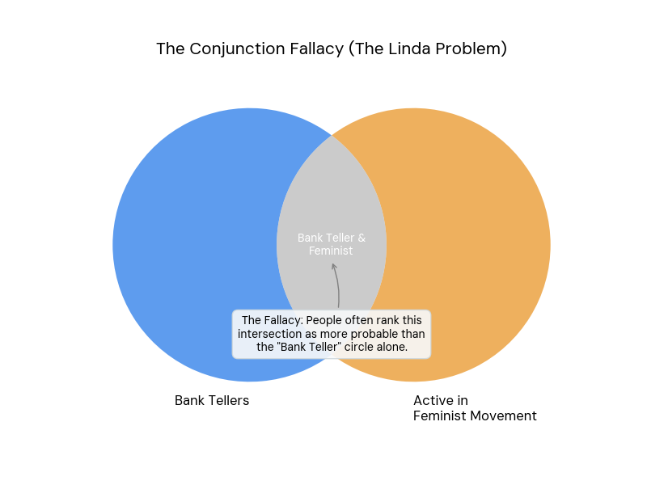

The Conjunction fallacy occurs when one believes that the probability of the conjunction of two events (i.e. occurring together) is greater than that of one of its constituents, i.e. P(A∩B) > P(A) (which is impossible).

It arises because the description feels more representative of the person or situation we're evaluating, making it seem more probable.

::: {.callout-note icon=false collapse="false"}
## Example

#### The Linda Problem

In the classic [Linda Problem](https://pages.ucsd.edu/~cmckenzie/TverskyKahneman1983PsychRev.pdf), participants are given a description of a fictional woman named Linda:

> “Linda is 31 years old, single, outspoken, and very bright. She majored in philosophy. As a student, she was deeply concerned with issues of discrimination and social justice, and also participated in anti-nuclear demonstrations.”

Participants are then asked which is more probable:

* Option A: Linda is a bank teller.
* Option B: Linda is a bank teller and is active in the feminist movement.

The results showed that 85% of participants chose Option B. However, this is impossible mathematically: the probability of two events occurring together (a conjunction) is always less than or equal to the probability of either one occurring alone.

{width="600px" fig-align="center"}

::: {.also-relates}
**Also relates to:** [Representativeness Heuristic](representativeness.qmd) · [Base Rate Neglect](base-rate-neglect.qmd) · [Overconfidence](overconfidence.qmd) · [Illusion of Validity](illusion-of-validity.qmd)
:::

:::
