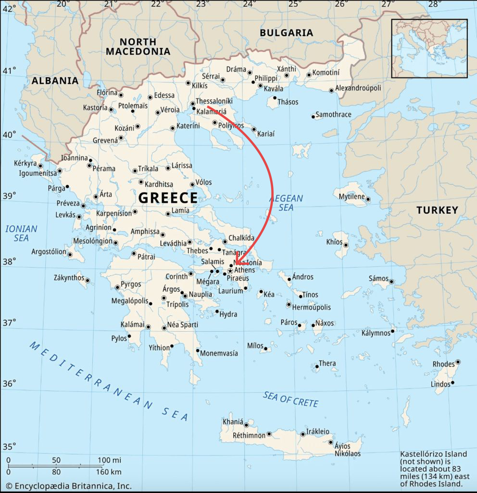

Conservatism bias refers to the slow updating of preferences in the face of new information. Combined with [Loss Aversion](loss-aversion.qmd), it leads to slow adaptation to good news but fast adaptation to bad news (which hurts more).

::: {.callout-note icon=false collapse="false"}
## Example

#### Job market transition
When moving to a new job market, a salary close to your previous one feels more acceptable than a vastly different one. However, this might be ignoring the fact that the cost of living and, by extent, salaries in the new job market might in average be much higher; the old anchor distorts the evaluation of the new offer.

{#fig-conservatism width="450px"}

::: {.also-relates}
**Also relates to:** [Reference Dependence](reference-dependence.qmd) · [Anchoring and Adjustment](anchoring-and-adjustment.qmd) · [Loss Aversion](loss-aversion.qmd)
:::

:::
