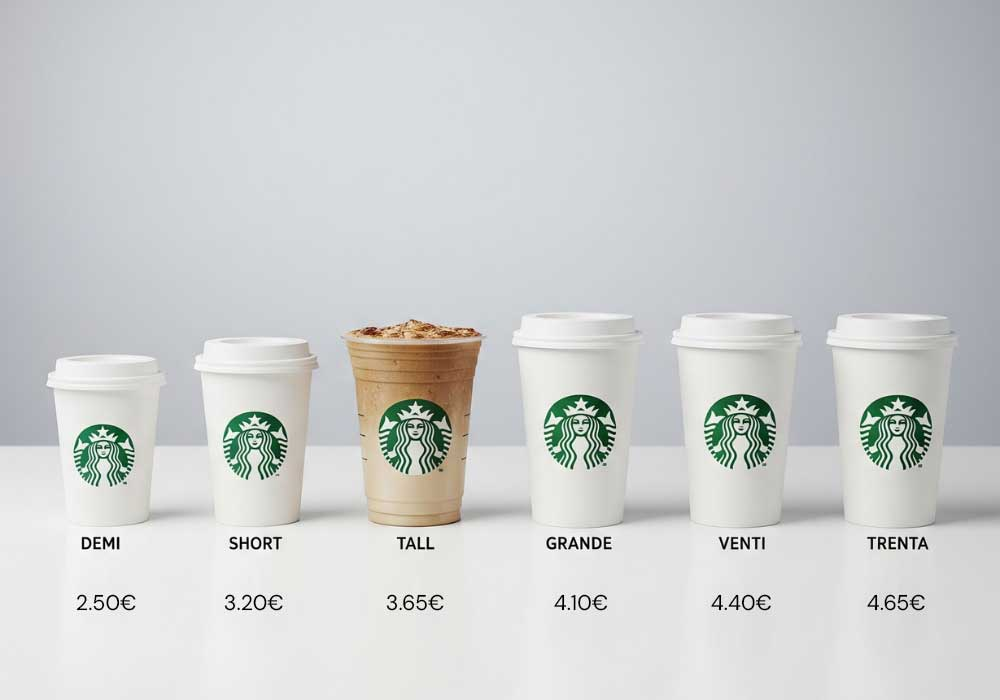

Context dependence describes how the same option can be more or less attractive depending on what else is in the choice set. It can further be distinguished into:

### Compromise Effect
The middle option in a set is preferred because it avoids the feeling of choosing an "extreme."

::: {.callout-note icon=false collapse="false"}
## Example

#### Coffee menu sizes
Adding a "Large" option (€7.00) to a café menu that previously had only Small (€3.00) and Medium (€4.50) makes the Medium feel like the sensible middle ground and increases its sales.

{width="600px" fig-align="center"}
:::

### Attraction Effect
Adding a "dummy" option that no one would pick, to make another option more attractive.

::: {.callout-note icon=false collapse="false"}
## Example

#### Subscription offers
A newspaper offers: (a) Web-only €59, (b) Print-only €125, (c) Web + Print €125. No one would choose Print-only over Web + Print at the same price; it's a decoy that makes option (c) look like a better deal.
:::

### Similarity Effect
Adding a similar option to a competitor's offering splits the share (e.g. votes or market share) they would receive.

::: {.callout-note icon=false collapse="false"}
## Example

#### Election candidates
A second progressive candidate entering a municipal election will lead to a split of the progressive votes between them, increasing thus the chances of their opponents.

:::

::: {.also-relates}
**Also relates to:**  [Frame Dependence](frame-dependence.qmd) · [Anchoring and Adjustment](anchoring-and-adjustment.qmd) · [Reference Dependence](reference-dependence.qmd) · [Narrow Framing](narrow-framing.qmd)
:::

