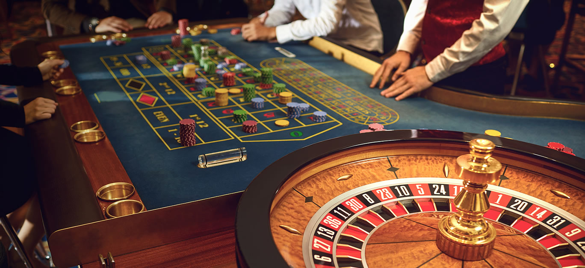

According to the Diminishing Sensitivity bias, smaller changes are perceived as more important close to the reference level than changes further away from it.

This creates the characteristic s-shape of the [Prospect Theory](prospect-theory.qmd]) value function, i.e. concave in the gain domain above the x-axis (more likely to stop gambling when winning) but convex in the loss domain below it (more likely to keep gambling when losing).

::: {.callout-note icon=false collapse="false"}
## Example

#### The gambling table
In simple terms, winning the first 100€ when gambling feels more valuable than winning an additional 100€; so people are less likely to keep gambling for more. Similarly, losing the first 100€ feels more painful than losing an additional 100€; so, people don’t mind gambling to reverse losses.

{width="450px" fig-align="center"}

::: {.also-relates}
**Also relates to:**  [Loss Aversion](loss-aversion.qmd) · [Reference Dependence](reference-dependence.qmd) · [Aversion to Ambiguity](aversion-to-ambiguity.qmd) · [Hyperbolic Discounting](hyperbolic-discounting.qmd)
:::

:::
