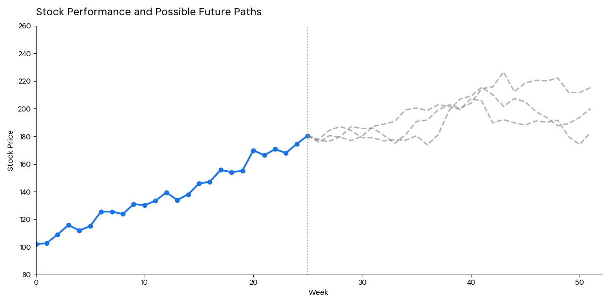

Extrapolation bias is the tendency to believe that recent trends will continue into the future, without accounting for the reasons that might cause them to reverse, such as profit-taking, market saturation, competition, or simple regression to the mean.

::: {.callout-note icon=false collapse="false"}
## Example

#### The doubling stock
An example is that of a stock doubling its value within a year, and assuming the trend will continue; however, in reality, if investors stop buying or early investors take profits, its value will just drop.

{width="750px" fig-align="center"}

::: {.also-relates}
**Also relates to:** [Hot Hand Fallacy](hot-hand-fallacy.qmd) · [Gambler's Fallacy](gamblers-fallacy.qmd) · [Overconfidence](overconfidence.qmd) · [Excessive Optimism](excessive-optimism.qmd) · [Information Cascades](information-cascades.qmd)
:::

:::
