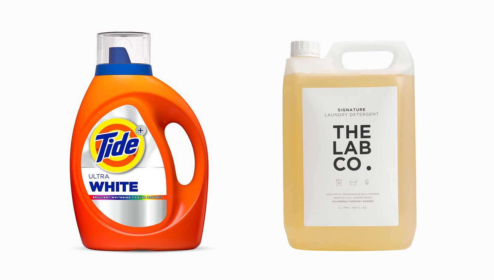

The familiarity bias is related to the fact that people tend to fear change and the unknown. Repeated exposure to a brand, option, or idea creates a sense of comfort and trust, and this is systematically exploited by advertisers: the more we encounter a brand, the more it feels like a safe, quality choice.

::: {.callout-note icon=false collapse="false"}
## Example

#### Name-brand detergent

When getting to choose between a well-advertised name-brand detergent that costs €10.00, and the generic store-brand bottle (with the same chemical formula) that costs €8.00, we will often prefer the former. In this case, the familiarity creates a false sense of "quality" or "safety" that doesn't exist in the product’s actual contents.

{width="300px" fig-align="center"}

::: {.also-relates}
**Also relates to:** [Affect Heuristic](affect-heuristic.qmd) · [Fluency Heuristic](fluency-heuristic.qmd) · [Illusion of Validity](illusion-of-validity.qmd)
:::

:::
