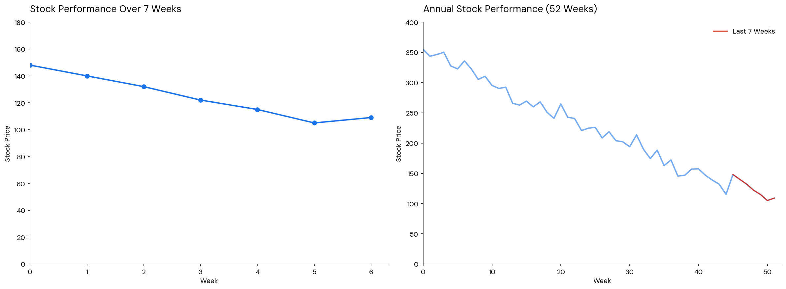

The gambler's fallacy is the mistaken belief that, after a run of one outcome of events, there’s bound to be a "reversal" or "balancing out", and therefore the opposite outcome is due. It arises from the representativeness heuristic: a short sequence that is all-heads doesn't look like what a random sequence should look like, so a tail feels more probable.

In reality, for statistically independent events (e.g. coin flips, roulette spins), previous outcomes have no effect on the next one.

::: {.callout-note icon=false collapse="false"}
## Example

#### Falling stock
A stock has been going down in recent weeks and, thinking that it is bound to recover, we invest in it. In reality, however, it might have been dropping long before the period under examination and/or due to systematic reasons, e.g. market demand has changed or a new competitor has emerged.

{width="750px" fig-align="center"}

::: {.also-relates}
**Also relates to:** [Hot Hand Fallacy](hot-hand-fallacy.qmd) · [Law of Small Numbers](law-of-small-numbers.qmd) · [Extrapolation Bias](extrapolation-bias.qmd) · [Loss Aversion](loss-aversion.qmd) · [Aversion to a Sure Loss](aversion-sure-loss.qmd)
:::

:::
