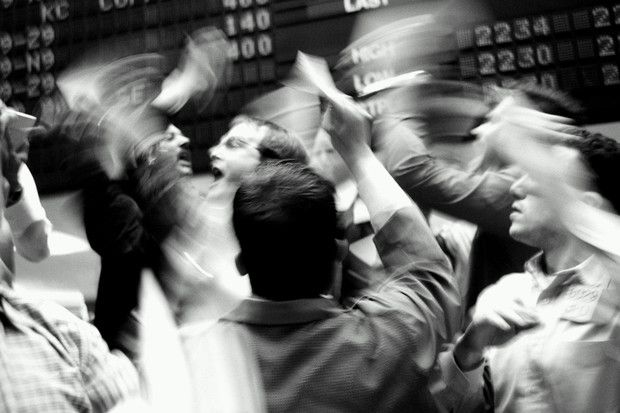

Fear in financial decisions may result from the unknown, from change, or from the possibility of collapse. When combined with greed, it can lead to increased risk-taking. In general, when combined with our tendency to react quickly and impulsively to emotional stimuli (“emotional reactivity”), it has been found to be negatively correlated with successful trading.

::: {.callout-note icon=false collapse="false"}
## Examples

#### Bubbles and crashes

Think of market bubbles and crashes!

{width="450px" fig-align="center"}

::: {.also-relates}
**Also relates to:**[Information Cascades](information-cascades.qmd) · [Availability Cascades](availability-cascades.qmd) · [Extrapolation Bias](extrapolation-bias.qmd) · [Loss Aversion](loss-aversion.qmd) · [Affect Heuristic](affect-heuristic.qmd) · [Social Contagion](social-contagion.qmd)
:::

:::