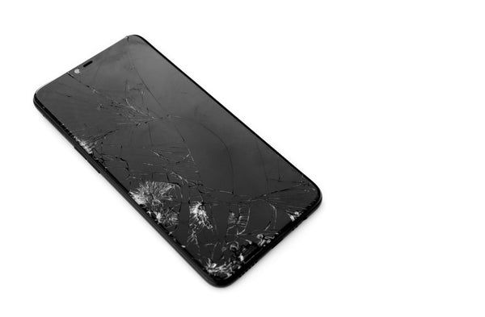
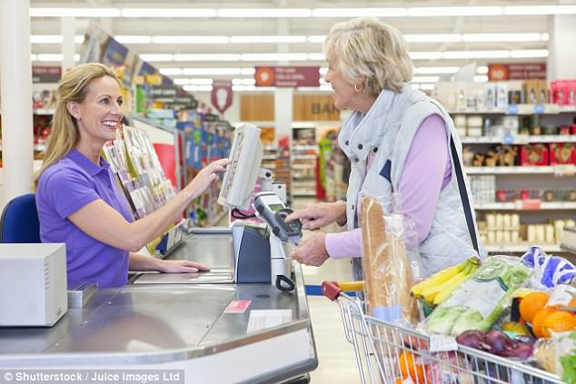

It’s when we narrate events in a way that makes us feel happier. We therefore tend to combine losses with larger gains (to reduce pain) or separate gains into smaller parts (to increase pleasure).

::: {.callout-note icon=false collapse="false"}
## Examples

#### Broken screen
A person feels less upset about losing €20 on fixing the broken screen of their mobile phone when they remember that they saved €50 when buying it. By mentally combining the loss with the earliest gain, the net outcome feels positive, which reduces the emotional impact of the loss.

{width="450px" fig-align="center"}

#### Split rewards at checkout
Super-markets deliberately break down rewards into multiple different instances, such as shelf discounts and separate cash back offered at the till, so that costumers feel that they get more rewards instead of one.

{width="450px" fig-align="center"}

::: {.also-relates}
**Also relates to:** [Mental Accounting](mental-accounting.qmd) · [Loss Aversion](loss-aversion.qmd) · [Reference Dependence](reference-dependence.qmd) · [Choice Bracketing](choice-bracketing.qmd)
:::

:::
