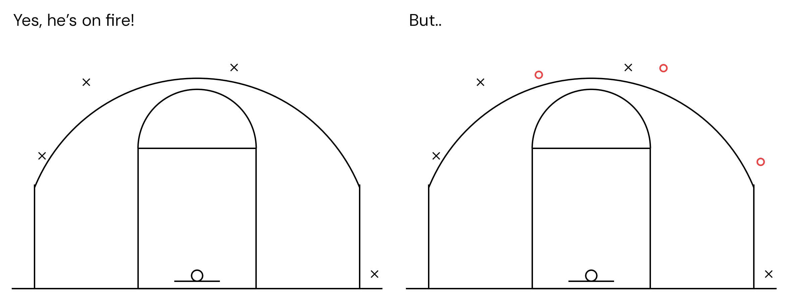

The hot hand fallacy is the belief that long streaks are bound to continue, failing to account for systematic reasons or the statistical independence of events. It's similar to the [gambler’s fallacy](gamblers-fallacy.qmd), only here one is expecting excessive persistence rather than reversals.

The hot hand fallacy also creates the momentum effect, where investors keep investing in a stock, thinking it's bound to keep rising. The buying itself pushes the price even higher, long after the fundamental reason for the initial rise (e.g. a new product launch) has passed.

::: {.callout-note icon=false collapse="false"}
## Example

#### The basketball player
Believing that a basketball player that makes four 3-pointers in a row will keep his streak going. While it is true that their increased confidence plays a role, (a) the next shots are statistically independent from the previous ones and (b) the game (i.e. the opposing team defense) will also adapt to the initial streak; the player’s final game shooting accuracy will likely end up within the natural variance of their skill level.

{width="750px" fig-align="center"}

::: {.also-relates}
**Also relates to:** [Gambler's Fallacy](gamblers-fallacy.qmd) · [Extrapolation Bias](extrapolation-bias.qmd) · [Law of Small Numbers](law-of-small-numbers.qmd) · [Overconfidence](overconfidence.qmd) · [Information Cascades](information-cascades.qmd)
:::

:::
