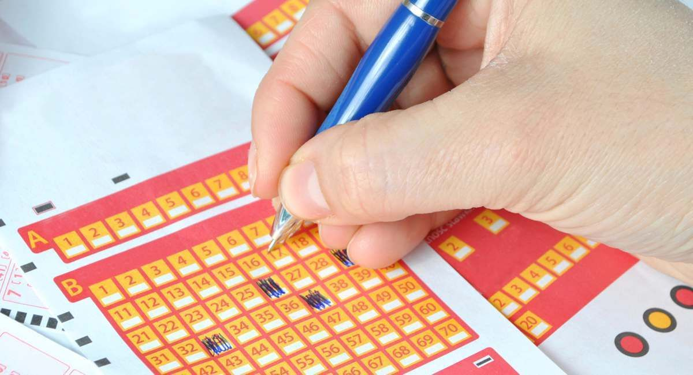

Illusion of control refers to believing that random events are subject to our control (see also the concept of [Magical Thinking](https://en.wikipedia.org/wiki/Magical_thinking) in psychology).

::: {.callout-note icon=false collapse="false"}
## Example

#### Lottery numbers

Believing that picking the numbers of the lottery will increase one’s chances of winning it. In reality, the chances range between [1 in 14.000.000](https://rss.onlinelibrary.wiley.com/doi/full/10.1111/j.1740-9713.2012.00540.x) (smaller games) to 1 in 140.000.000 (Euro lottery draws) or 1 in 292.000.000 (USA Powerball lottery).

{width="600px" fig-align="center"}

::: {.also-relates}
**Also relates to:** [Overconfidence](overconfidence.qmd) · [Self-Attribution Bias](self-attribution-bias.qmd) · [Excessive Optimism](excessive-optimism.qmd) · [Gambler's Fallacy](gamblers-fallacy.qmd)
:::

:::
