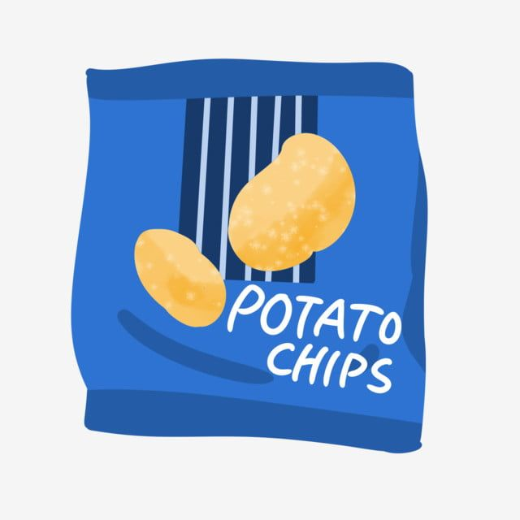

To think your judgement is valid, even when the evidence you have at hand is weak or unreliable.

::: {.callout-note icon=false collapse="false"}
## Example

#### Product packaging
Assuming a product is good because of its packaging or wording.

{width="300px"}

::: {.also-relates}
**Also relates to:**  [Representativeness Heuristic](representativeness.qmd) · [Affect Heuristic](affect-heuristic.qmd) · [Overconfidence](overconfidence.qmd) · [Confirmation Bias](confirmation-bias.qmd) · [Familiarity](familiarity.qmd)
:::

:::
