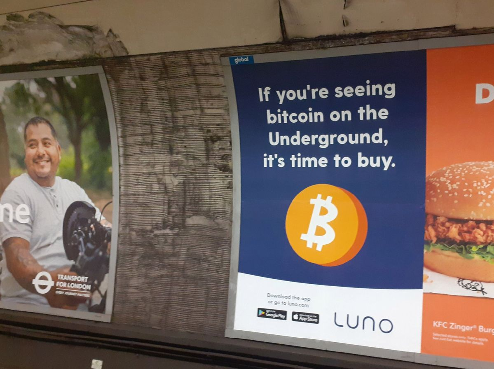

This bias can be summed up as "maybe everyone else knows something I don't" and it occurs when individuals follow the actions of others while ignoring their own information.

::: {.callout-note icon=false collapse="false"}
## Example

#### Crypto investing
Investing in a specific asset (e.g. crypto) because everyone else is. In reality, each new investor might be copying the previous wave of investors, who were themselves copying earlier waves.

{width="450px" fig-align="center"}

::: {.also-relates}
**Also relates to:**  [Social Contagion](social-contagion.qmd) · [Communal Reinforcement](communal-reinforcement.qmd) · [Hot Hand Fallacy](hot-hand-fallacy.qmd) · [Extrapolation Bias](extrapolation-bias.qmd) · [Greed and Fear](greed-and-fear.qmd)
:::

:::
