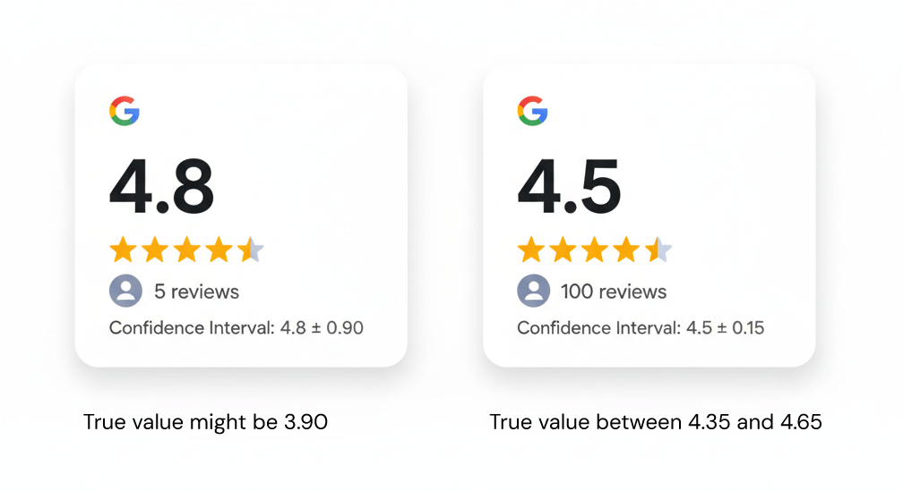

It's the mistake to believe that a small sample accurately resembles the parent population. In reality, small samples have a small confidence interval and will eventually regress to the mean as the sample grows.

::: {.callout-note icon=false collapse="false"}
## Example

#### Google reviews
"Let's try this restaurant, it's got a 4.8 rating, higher than the other option, at 4.5". However, with only 5 reviews the Confidence Interval of a review rating might be 4.8 ± 0.90 (hence between 3.90 and 5.00), whereas at 100 reviews 4.5 ± 0.15 (between 4.65 and 4.35). In other words, the latter restaurant's rating is statistically more reliable.

{width="600px" fig-align="center"}

#### Stock performance
Taking into account the performance of a stock over a limited period of time, rather than a longer (and more representative) projectory.

::: {.also-relates}
**Also relates to:**  [Representativeness Heuristic](representativeness.qmd) · [Gambler's Fallacy](gamblers-fallacy.qmd) · [Hot Hand Fallacy](hot-hand-fallacy.qmd) · [Extrapolation Bias](extrapolation-bias.qmd) · [Base Rate Neglect](base-rate-neglect.qmd)
:::

:::
