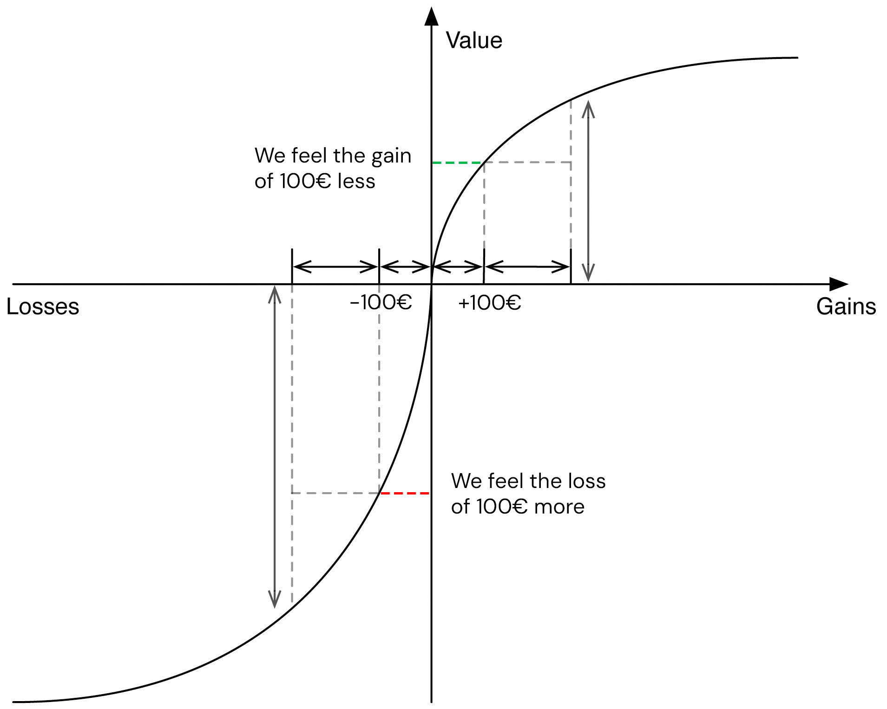

People suffer more from a loss than they enjoy a gain of the same magnitude. This asymmetry is called loss aversion, is central to the [Prospect Theory](prospect-theory.qmd) and it may explain why consumers and investors are less willing to take risks when winning, but more risk-prone when losing.

{width="450px" fig-align="center"}

::: {.also-relates}
**Also relates to:** [Reference Dependence](reference-dependence.qmd) · [Aversion to Ambiguity](aversion-to-ambiguity.qmd) · [Conservatism](conservatism.qmd) · [Hyperbolic Discounting](hyperbolic-discounting.qmd) · [Narrow Framing](narrow-framing.qmd) · [Myopic Loss Aversion](myopic-loss-aversion.qmd)
:::
