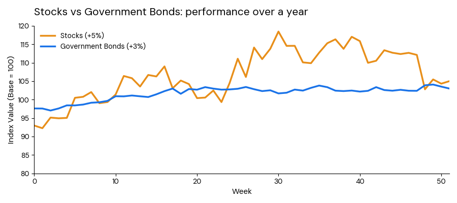

It's the tendency to evaluate events in isolation, rather than considering the whole picture.

Related to narrow framing is the perception of money utility:

*	Consumption Utility approach: We don't care about money per se, but about the things it actually buys; utility is a function of consumption $u=f(c)$. In this case, if your salary goes down 5% but inflation also drops 5%, you realise that your purchasing power hasn't increased.
*	Direct Utility from Fluctuations approach: We are affected by the nominal changes in our wealth. This means that rather than caring about what we can actually buy with our money (real wealth), we are affected by the mere experience of watching numbers (i.e. savings, salary etc.) change, regardless of what that money can buy. In the context of the previous example, it would mean that the 5% rise makes us feel more wealthy.

::: {.callout-note icon=false collapse="false"}
## Examples

#### Stocks vs. bonds

While investing in stocks [offers in general higher long-term returns than government bonds](https://www.ubs.com/global/en/investment-bank/insights-and-data/2024/global-investment-returns-yearbook.html), fewer people invest in them because they fluctuate more. The reason for this is that higher day to day fluctuation (volatility) makes them feel riskier (i.e. we evaluate an event in isolation), even if the long-term return (i.e. the whole picture) is higher. On the other hand, government bonds fluctuate less and thus feel more certain.

{width="750px" fig-align="center"}

#### The over-committed freelancer

A freelancer accepts every project requested by clients because they don't want to miss out on any opportunities; they are therefore evaluating each request in isolation. However, this overcommitment risks compromising the most important or valuable of the projects (i.e. they are missing the whole picture).

::: {.also-relates}
**Also relates to:** [Frame Dependence](frame-dependence.qmd) · [Myopic Loss Aversion](myopic-loss-aversion.qmd) · [Mental Accounting](mental-accounting.qmd) · [Choice Bracketing](choice-bracketing.qmd) · [Repeated Gambles](repeated-gambles.qmd)
:::

:::
