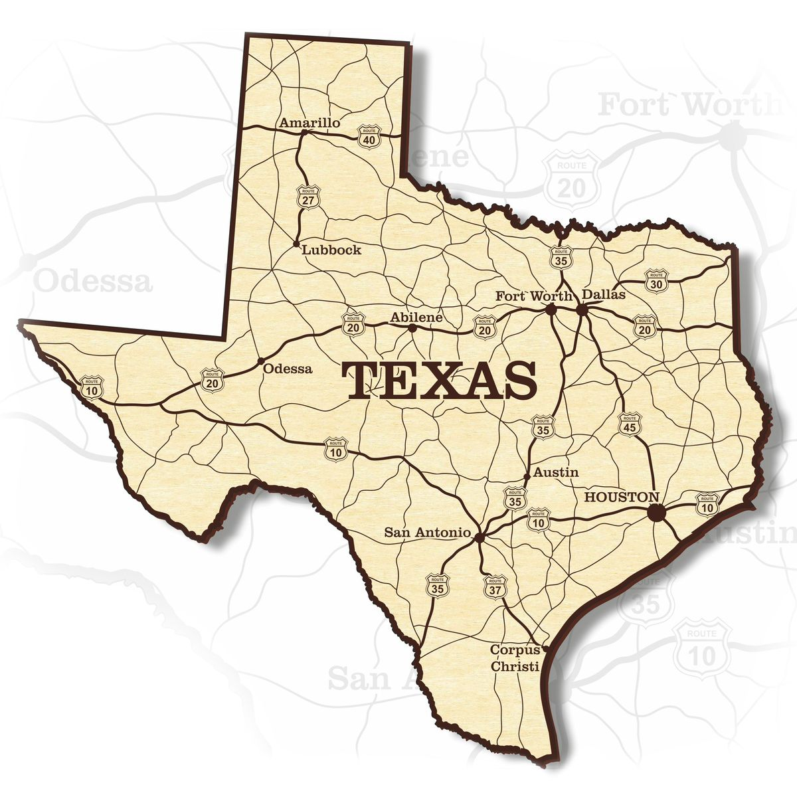

This bias involves assigning a higher value to an object we recognize. The heuristic is considered rational when the recognition criterion has some validity.

::: {.callout-note icon=false collapse="false"}
## Example

#### Texas cities
Guessing whether someone from Texas lives in Houston or San Antonio (which are generally more well-known locations) vs. Arlington (not that well-known). Since Houston and San Antonio are more recognizable, they are more likely to be chosen as answers. In this case, the bias has some validity and leads to a better choice: their larger populations make it more probable that a random Texan lives in one of them.

{width="450px" fig-align="center"}

::: {.also-relates}
**Also relates to:** [Familiarity](familiarity.qmd) · [Fluency Heuristic](fluency-heuristic.qmd) · [Illusion of Validity](illusion-of-validity.qmd) · [Availability Heuristic](availability-heuristic.qmd)
:::

:::
