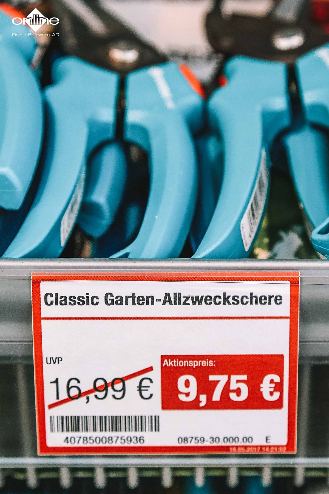

In reference dependence, we don't evaluate final states in isolation, but changes relative to a reference point. In this context, when gains occur we think of the recursively, i.e. the output of a previous step becomes the input of the next one, but when losses are involved, we tend to stick to the initial values and are therefore non-recursive.

::: {.callout-note icon=false collapse="false"}
## Example

#### Retail pricing
The simplest example is that of retailers keeping the initial price of a product alongside the discounted one; a €100 price feels less expensive when compared to an initial €150 anchor.

{width="300px" fig-align="center"}

::: {.also-relates}
**Also relates to:** [Loss Aversion](loss-aversion.qmd) · [Anchoring and Adjustment](anchoring-and-adjustment.qmd) · [Frame Dependence](frame-dependence.qmd) · [Diminishing Sensitivity](diminishing-sensitivity.qmd) · [Hedonic Editing](hedonic-editing.qmd)
:::

:::
