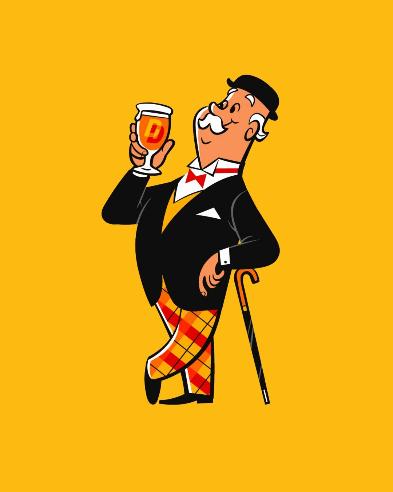

When one attributes successful outcomes to their personal abilities but unsuccessful ones to external factors or "sabotage". This leads to overconfidence, as one might expect!

::: {.callout-note icon=false collapse="false"}
## Example

#### Two businesses

Successes in business attempts become evidence of skill, while failures become evidence of unfair external factors at play. Neither attribution enables accurate self-assessment.

{width="300px" fig-align="center"}

::: {.also-relates}
**Also relates to:** [Overconfidence](overconfidence.qmd) · [Confirmation Bias](confirmation-bias.qmd) · [Hindsight Bias](hindsight-bias.qmd) · [Illusion of Control](illusion-of-control.qmd) · [Causality and Attribution](causality-and-attribution.qmd)
:::

:::
