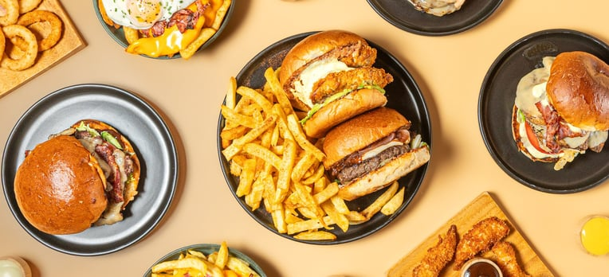

It's when we are unable to recognize that our present and future selves have different needs.

::: {.callout-note icon=false collapse="false"}
## Examples

#### Ordering food when starving

For example, we will order two burgers and fries because we’re hungry, only to later realize that we are already full by the time we’ve eaten the first one. Similarly, we’ll pay for a yearly gym membership motivated by our New Year’s resolution, only to realise by February that exercising is not fit for us.

{width="450px" fig-align="center"}

::: {.also-relates}
**Also relates to:** [Hyperbolic Discounting](hyperbolic-discounting.qmd) · [Choice Bracketing](choice-bracketing.qmd) · [Excessive Optimism](excessive-optimism.qmd) · [Repeated Gambles](repeated-gambles.qmd)
:::

:::
