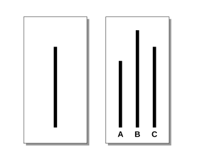

As a society, we have a tendency toward conformity that is so strong it can lead intelligent, well-meaning people to be willing to call white black.

As a society, we have a tendency toward conformity powerful enough to cause otherwise intelligent, well-meaning people to adopt beliefs or behaviours they initially / privately disagree with.

::: {.callout-note icon=false collapse="false"}
## Example

#### The Asch Conformity Experiments

The [Asch Conformity Experiment](https://en.wikipedia.org/wiki/Asch_conformity_experiments), conducted by psychologist Solomon Asch in the 1950s, remains one of the most famous demonstrations of how peer pressure can override individual judgment. In the study, a single real participant was placed in a room with several "confederates", i.e. actors who were following an agreed script. The group was shown a "reference line" and three "comparison lines" of varying lengths, one of which was clearly identical to the reference.

Initially, the actors provided the correct answer, but they eventually began to unanimously select a line that was obviously the wrong length. Faced with this obvious contradiction, the real participant had to choose between what they were seeing with their own eyes and the consensus of the group.

It was found that a significant majority of participants conformed to the incorrect group answer, later admitting they did so not because they actually saw the lines differently, but because they feared being perceived as "peculiar" or assumed the group must know something they didn't.

{width="300px" fig-align="center"}

::: {.also-relates}
**Also relates to:** [Obedience to Authority](obedience-to-authority.qmd) · [Communal Reinforcement](communal-reinforcement.qmd) · [Information Cascades](information-cascades.qmd) · [Groupthink](communal-reinforcement.qmd) · [Confirmation Bias](confirmation-bias.qmd)
:::

:::
