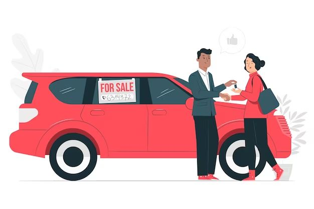

This bias relates to buying products out of jealousy, to boost self-esteem, resulting from the prejudice comparisons create.

::: {.callout-note icon=false collapse="false"}
## Example

#### Buying a new car
An example is that of taking a consumer loan to buy a new car, when other needs should have been met first (e.g. better education or housing), thinking that a new car provides status.

{width="450px" fig-align="center"}

::: {.also-relates}
**Also relates to:** [Social Contagion](social-contagion.qmd) · [Communal Reinforcement](communal-reinforcement.qmd)
:::

:::
